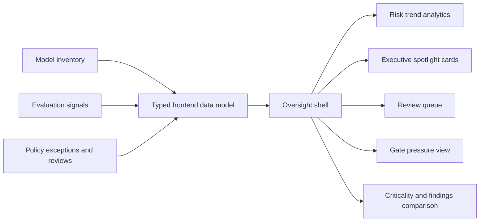
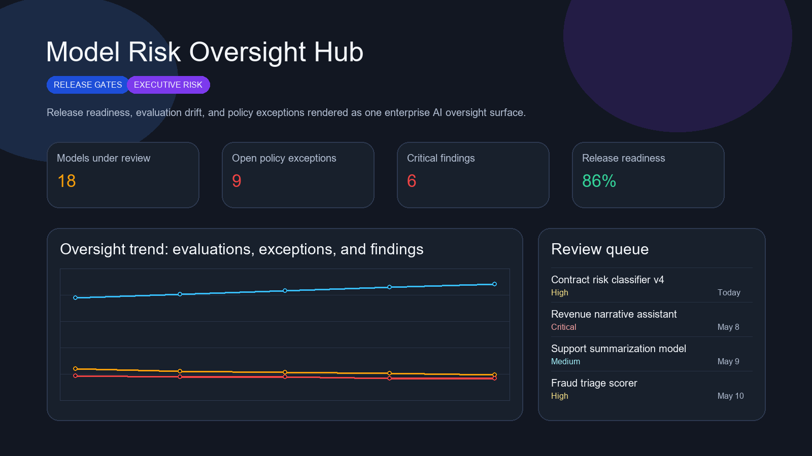
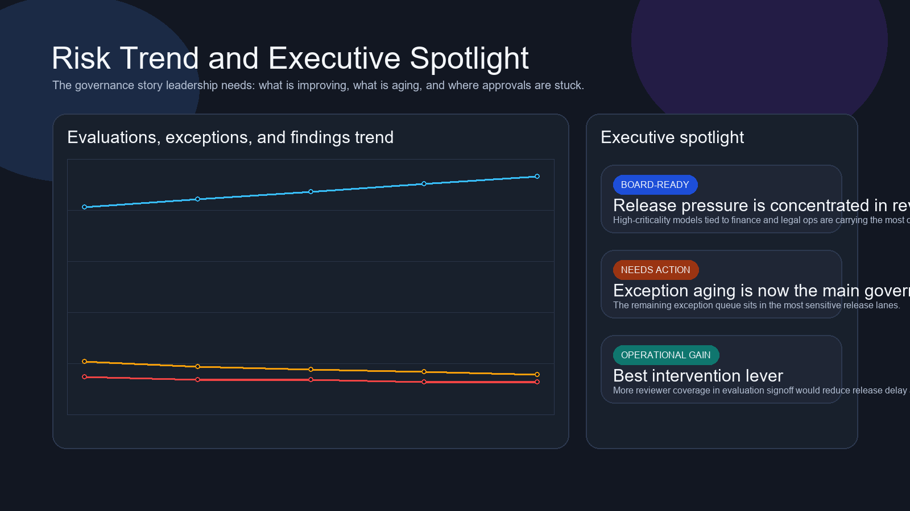
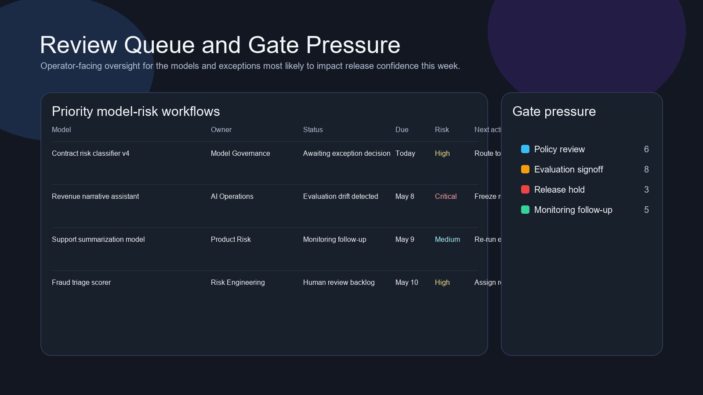
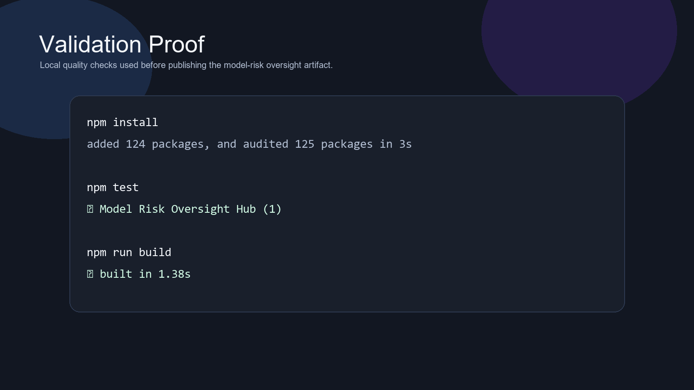

# Model Risk Oversight Hub

> **React + TypeScript portfolio project** demonstrating model criticality, release gating, evaluation drift, policy exceptions, review backlog pressure, and executive AI risk visibility.

**Recruiter takeaway:** *"This person understands AI governance as enterprise risk oversight, not just prompt experiments and dashboards."*

---

## Project Overview

| Attribute | Detail |
|---|---|
| **Frontend Stack** | React 19 + Vite + TypeScript |
| **Domain** | AI governance, model risk, release oversight |
| **Audience** | AI governance, product risk, legal, security, executive stakeholders |
| **Signal Areas** | Release readiness · evaluation drift · exception aging · critical model exposure |
| **Portfolio Role** | Frontend proof of enterprise AI risk oversight product thinking |
| **Validation** | Vitest + Testing Library |

---

## Executive Summary

Model Risk Oversight Hub is a recruiter-ready frontend project built to feel like a real internal oversight workspace for organizations running AI in production. Instead of framing governance as a policy archive or evaluation spreadsheet, it turns release gates, drift signals, policy exceptions, and reviewer backlog into one command surface that product, legal, security, and executive stakeholders can all read.

This repo is designed to show that model governance becomes more useful when it behaves like an operating system for risk decisions, not a static checklist.

---

## Business Problem

Model risk becomes difficult to manage when release gates, evaluation findings, and policy exceptions are scattered across tools and teams. That creates familiar problems:

- critical models ship under inconsistent release standards
- evaluation drift is seen too late
- exceptions age in high-risk lanes
- executives can see volume, but not where decisions are stuck

Teams need one workspace that makes AI risk legible, actionable, and operationally accountable.

---

## Solution

This project reframes model governance as an operator-grade product surface for:

- model inventory and criticality
- release gating and approval pressure
- evaluation drift visibility
- policy exception tracking
- board-readable AI risk posture

---

## Architecture



### Workspace Flow

1. Stakeholders land on one oversight posture surface.
2. Trends show whether evaluations are improving and whether exception pressure is falling.
3. Spotlight cards translate risk into leadership-readable language.
4. The review queue shows what needs release, exception, or reviewer decisions next.
5. Domain comparison exposes where criticality and findings overlap most dangerously.

---

## Screenshots

### Hero Capture



### Risk Trend and Executive Spotlight



### Review Queue and Gate Pressure



### Validation Proof



---

## Key Design Decisions

| Decision | Rationale |
|---|---|
| **Oversight-hub framing** | Makes the repo feel like enterprise AI risk infrastructure instead of a generic AI dashboard |
| **Release + risk pairing** | Connects technical quality signals to governance and business decision-making |
| **Static data model** | Keeps the repo easy to run while preserving realistic oversight stories |
| **Distinct risk-operations visual theme** | Keeps this repo visually separate from identity, compliance, and AI-ops tools |
| **Queue and exception emphasis** | Focuses attention on where governance work gets stuck, not just where metrics exist |

---

## What An Engineering Leader Sees Here

- frontend execution grounded in enterprise AI governance reality
- ability to turn risk, review, and release concepts into usable product structure
- strong internal-tool UX thinking for multi-stakeholder workflows
- broader portfolio range across AI ops, identity, security, compliance, and revenue systems

---

## Getting Started

### Prerequisites

- Node.js 20+
- npm

### Setup

```bash
git clone https://github.com/mizcausevic-dev/model-risk-oversight-hub.git
cd model-risk-oversight-hub
npm install
cp .env.example .env
npm run dev
```

Open:

- `http://localhost:5173`

### Run Tests

```bash
npm test
```

### Build

```bash
npm run build
```

---

## What This Demonstrates

- model governance and AI oversight understanding
- release and exception workflow design
- executive-facing risk product thinking
- React + TypeScript delivery with production-minded repo hygiene
- portfolio depth beyond prompt demos and chatbot wrappers

---

## Future Enhancements

- model-card drilldowns and evidence packages
- review assignment and escalation routing
- evaluation scenario diffing
- deployment history overlays
- risk forecasting across release trains

---

## Tech Stack

[](https://react.dev/)
[](https://vite.dev/)
[](https://www.typescriptlang.org/)
[](https://recharts.org/en-US/)
[](https://vitest.dev/)
[](https://opensource.org/license/mit)

### Portfolio Links

- [LinkedIn](https://www.linkedin.com/in/mirzacausevic)
- [Skills Page](https://mizcausevic.com/skills/)
- [Medium](https://medium.com/@mizcausevic)
- [GitHub](https://github.com/mizcausevic-dev)

---

*Part of [mizcausevic-dev's GitHub portfolio](https://github.com/mizcausevic-dev) — demonstrating enterprise AI oversight product thinking, executive-readable governance UX, and release-aware model risk workflows.*
