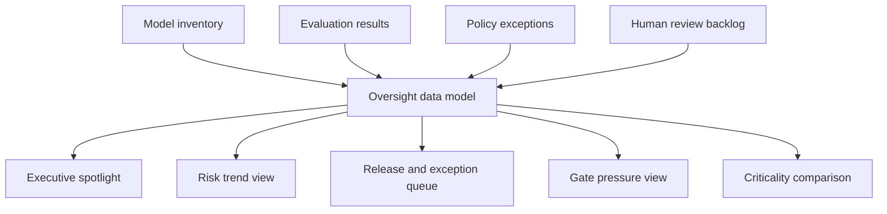

# Model Risk Oversight Hub Architecture

## Intent

Model Risk Oversight Hub is a frontend-first internal tool concept for making release pressure, evaluation drift, and policy exceptions visible in one enterprise AI governance workspace.

The product is designed to help multiple stakeholders read the same risk posture without turning governance into static documentation.

## System Flow

## Product Surfaces

- **Risk trend view**: shows whether the oversight posture is improving or drifting
- **Executive spotlight**: translates model risk into business-facing language
- **Review queue**: clarifies what decisions are blocking release or creating governance drag
- **Gate pressure view**: reveals where approval and release work is backing up
- **Criticality comparison**: highlights where sensitive domains and findings overlap

## Why This Matters

This repo exists to show that model governance is not just about evaluation results:

- it is also about release timing
- exception ownership
- reviewer capacity
- executive visibility

That makes it a stronger portfolio signal than a generic AI dashboard or demo UI.
